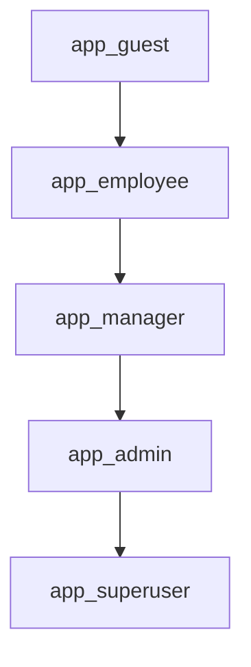

# Политика безопасности

## Проект

`task_management` — учебная база данных для системы управления задачами.

## Цель документа

Зафиксировать выбранную модель доступа, иерархию ролей и правила предоставления прав.

## Выбранная модель

Базовая модель — RBAC. Доступ назначается не напрямую пользователям, а через роли:

- `app_guest` — чтение только публичных проектов;
- `app_employee` — работа со своими задачами и комментариями;
- `app_manager` — управление проектами и задачами своего контура;
- `app_admin` — администрирование данных и объектов схемы;
- `app_superuser` — техническая роль для полной диагностики и аварийных действий.

## Иерархия ролей

## Правила предоставления доступа

1. Любой новый пользователь получает только одну прикладную роль.
2. Повышение прав идет по цепочке `employee -> manager -> admin`.
3. Права на чтение и запись выдаются явно через `GRANT`.
4. Для чувствительных таблиц допускается дополнительное ограничение через RLS.
5. Прямое использование `app_superuser` допускается только для диагностики.

## Порядок отзыва доступа

1. Отозвать прикладную роль у пользователя.
2. Заблокировать вход через `ALTER ROLE ... NOLOGIN`, если учетная запись больше не нужна.
3. Проверить отсутствие лишнего членства в `pg_auth_members`.

## Регламент аудита

1. Регулярно проверять состав ролей командой `\du`.
2. Проверять привилегии через `information_schema.role_table_grants`.
3. Фиксировать изменения ролей и привилегий в SQL-скриптах репозитория.

## Приложения

- SQL-сценарий создания ролей: `scripts/02_access_models/setup.sql`
- Сценарий проверки: `scripts/02_access_models/verify.sql`
