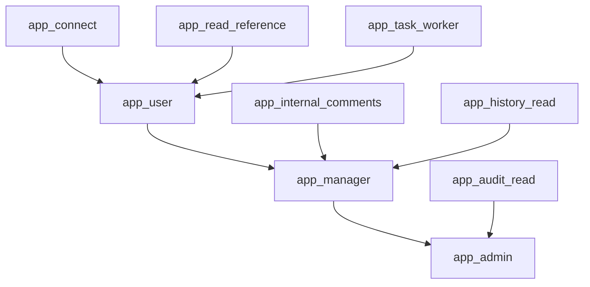

# Практика 4. Политика ролей для `corporate_tasks`

## Бизнес-роли

- `app_user` — обычный сотрудник;
- `app_manager` — менеджер проекта;
- `app_admin` — администратор;
- `marketing_eve` — пример отдельного read-only пользователя.

## Контейнерные роли

- `app_connect` — подключение к БД и доступ к схеме;
- `app_read_reference` — чтение справочников;
- `app_task_worker` — чтение проектов и задач, добавление комментариев;
- `app_internal_comments` — доступ к внутренним комментариям;
- `app_history_read` — просмотр истории изменений;
- `app_audit_read` — просмотр логов доступа;
- `app_read_all` — пример read-only роли для несистемного пользователя.

## Иерархия

## Логика разграничения

1. `app_user` читает справочники, проекты и задачи, но не управляет ими.
2. `app_manager` наследует права пользователя и получает доступ к изменениям проектов, задач и истории.
3. `app_admin` наследует права менеджера и получает аудитные и DDL-права.

## Пользователи БД

| Роль БД | Прикладная роль |
|---|---|
| `dev_alice` | `app_user` |
| `dev_charlie` | `app_user` |
| `pm_bob` | `app_manager` |
| `admin_diana` | `app_admin` |
| `marketing_eve` | `app_read_all` |
