# Отчет по проверке DB_SEC_SITE через сайт

Проверялся учебный сайт `DB_SEC_SITE`: <https://github.com/Wheatgrh/DB_SEC_SITE>.

Сайт был запущен локально. Проверка делалась как у обычного пользователя: через браузер, формы, прямые ссылки и HTTP-запросы к самому сайту. Исходные файлы сайта не изменялись. В отчете ниже для каждой проблемы есть два скриншота: что вводилось и что получилось.

Основной пользователь для проверки: `alice`, роль `student`.

## 1. SQL-инъекция в поиске клиентов

В поиске клиентов вместо обычного email был введен payload:

```sql
' OR true --
```

Из-за этого сайт показал всех клиентов, включая чужие записи.

**Скрин ввода:**


**Скрин результата:**

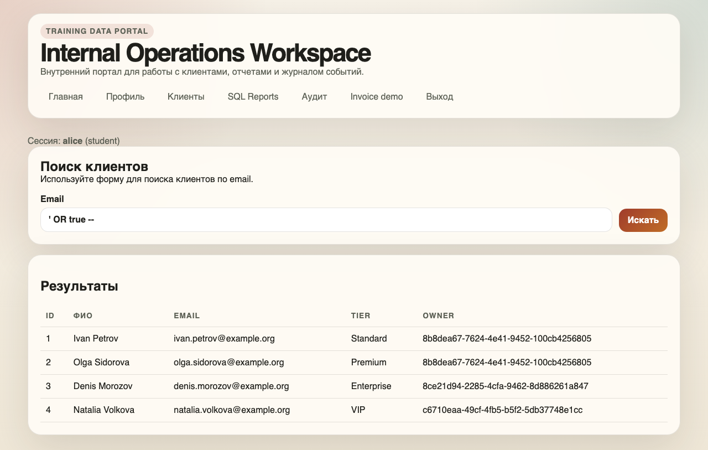

**Как исправить кодом:**

Нельзя подставлять текст пользователя прямо в SQL. Нужно передавать значение параметром.

```ts
const search = q.trim();

const result = await pool.query(
	`
		SELECT id, full_name, email, tier, owner_user_id
		FROM training.customers
		WHERE email ILIKE '%' || $1 || '%'
		ORDER BY id
	`,
	[search]
);
```

## 2. SQL Reports показывает все счета

В разделе SQL Reports в поле условия было введено:

```sql
true
```

Такое условие всегда истинно, поэтому сайт вывел все счета, включая чужие суммы и `card_hint`.

**Скрин ввода:**

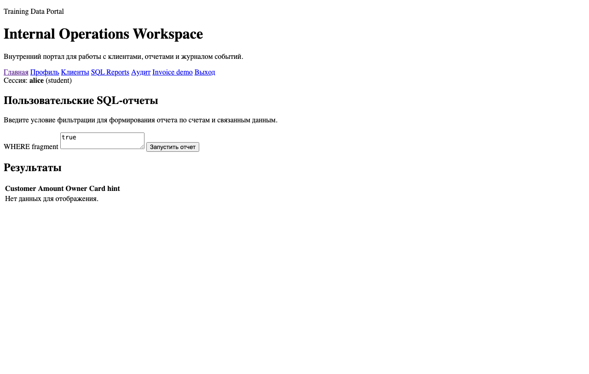

**Скрин результата:**

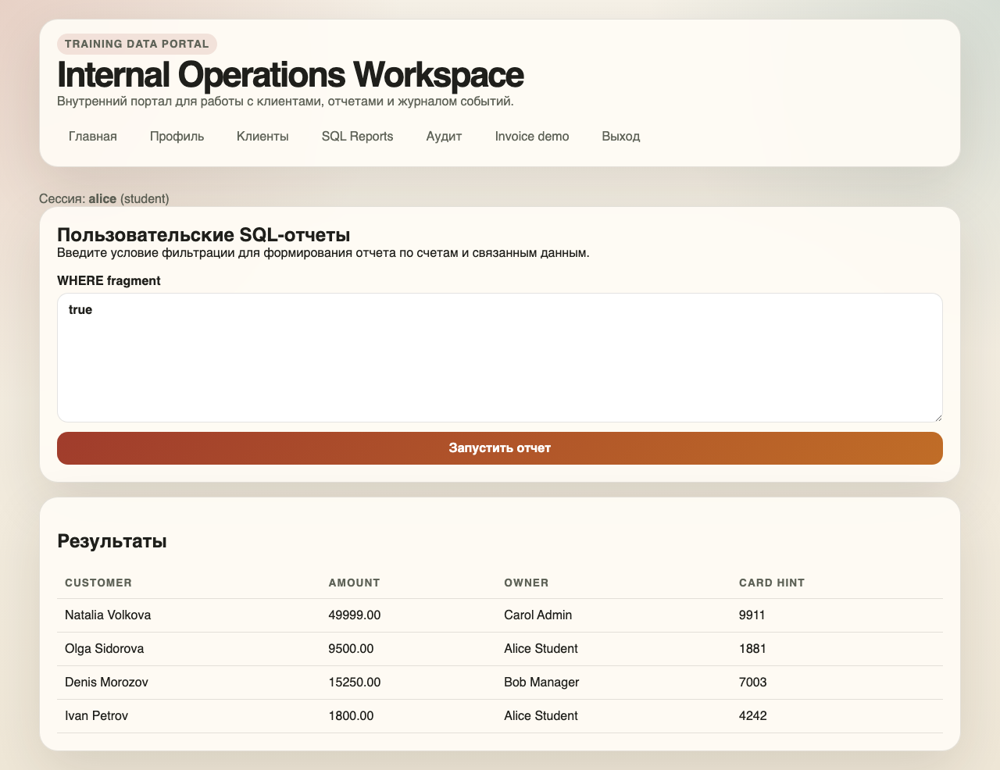

**Как исправить кодом:**

Пользователь не должен вводить SQL. Вместо этого нужно сделать обычные фильтры и разрешить только заранее известные значения.

```ts
const allowedStatuses = new Set(['paid', 'pending', 'overdue', 'draft']);

if (!allowedStatuses.has(status)) {
	error(400, 'Некорректный статус');
}

const result = await pool.query(
	`
		SELECT customer_name, amount, owner_name
		FROM training.safe_invoice_report
		WHERE status = $1
	`,
	[status]
);
```

## 3. SQL Reports принимает подзапросы

В поле отчета можно ввести не простой фильтр, а подзапрос:

```sql
i.owner_user_id = (SELECT id FROM training.app_users WHERE username = 'carol')
```

После этого обычный пользователь получает счет администратора `carol`.

**Скрин ввода:**


**Скрин результата:**

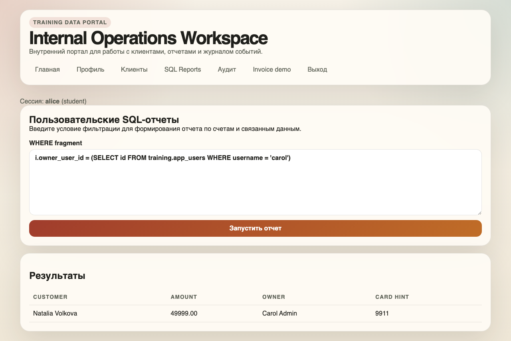

**Как исправить кодом:**

Фильтр должен собираться из белого списка полей. Например, пользователь выбирает владельца из разрешенного списка, а сервер сам добавляет условие.

```ts
const filters: string[] = [];
const values: unknown[] = [];

if (ownerId) {
	values.push(ownerId);
	filters.push(`i.owner_user_id = $${values.length}`);
}

values.push(locals.user.id);
filters.push(`i.owner_user_id = $${values.length}`);

const result = await pool.query(
	`
		SELECT c.full_name, i.amount, u.full_name AS owner_name
		FROM training.invoices i
		JOIN training.customers c ON c.id = i.customer_id
		JOIN training.app_users u ON u.id = i.owner_user_id
		WHERE ${filters.join(' AND ')}
	`,
	values
);
```

## 4. Техническая ошибка видна пользователю

В SQL Reports можно ввести некорректное условие, например:

```sql
bad_column = 1
```

Сайт возвращает техническую ошибку. По таким ошибкам проще понять устройство базы и подобрать рабочую инъекцию.

**Скрин ввода:**


**Скрин результата:**

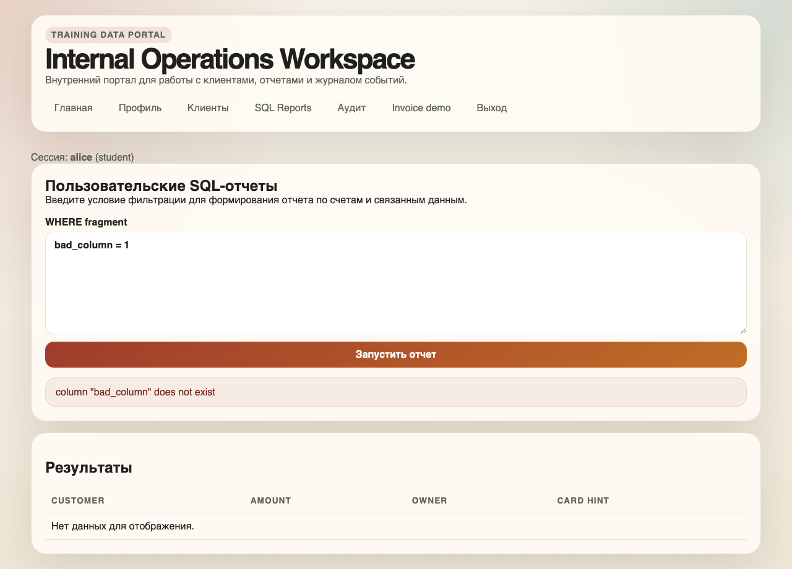

**Как исправить кодом:**

Пользователю нужно показывать обычное сообщение, а технические детали писать только в серверный лог.

```ts
try {
	const results = await runReport(filters);
	return { results };
} catch (err) {
	console.error('Report failed', err);
	return fail(400, {
		error: 'Не удалось сформировать отчет. Проверьте параметры фильтра.'
	});
}
```

## 5. Чужой счет открывается по прямой ссылке

Пользователь `alice` открыл прямую ссылку на счет администратора `carol`.

**Скрин ввода:**

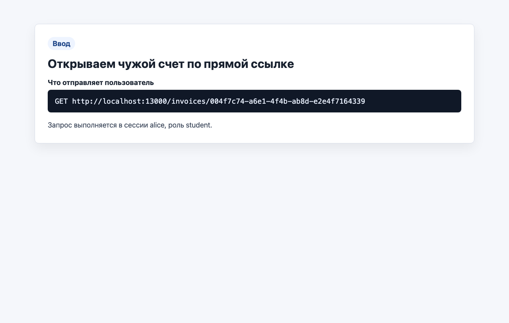

**Скрин результата:**

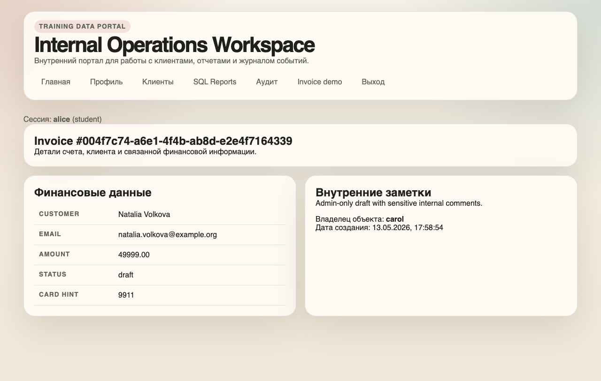

**Как исправить кодом:**

Перед показом счета нужно проверить владельца или роль пользователя.

```ts
const result = await pool.query(
	`
		SELECT *
		FROM training.invoices
		WHERE id = $1
		  AND (
		    owner_user_id = $2
		    OR $3 IN ('manager', 'admin')
		  )
	`,
	[invoiceId, locals.user.id, locals.user.role]
);

if (!result.rows[0]) {
	error(404, 'Счет не найден');
}
```

## 6. В счете показываются лишние чувствительные поля

После открытия чужого счета обычному пользователю видны `card_hint` и внутренняя заметка. Даже если пользователь имеет право видеть счет, не все поля должны быть доступны всем ролям.

**Скрин ввода:**

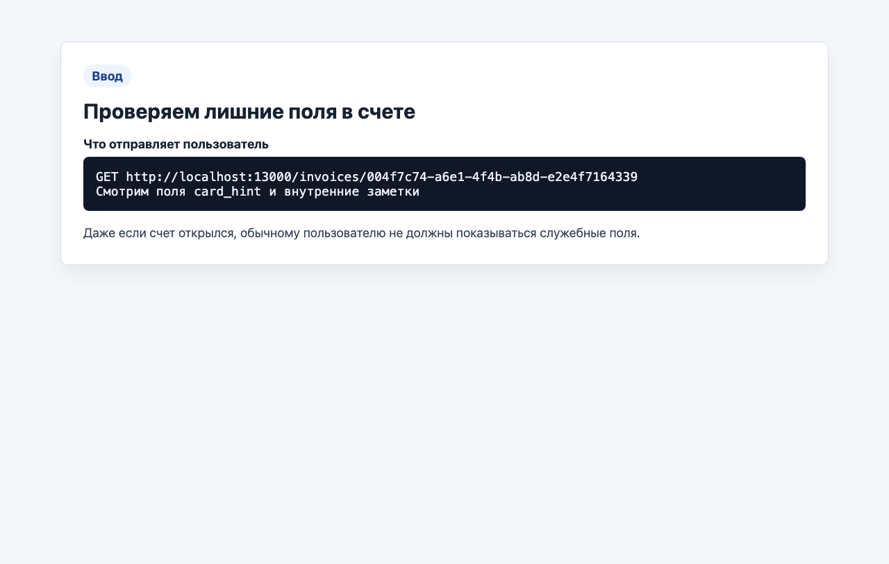

**Скрин результата:**


**Как исправить кодом:**

Нужно отдавать разные наборы полей для разных ролей.

```ts
const sql =
	locals.user.role === 'admin'
		? `
			SELECT amount, status, card_hint, notes
			FROM training.invoices
			WHERE id = $1
		`
		: `
			SELECT amount, status
			FROM training.invoices
			WHERE id = $1
		`;

const result = await pool.query(sql, [invoiceId]);
```

## 7. Журнал аудита доступен студенту

Пользователь `alice` с ролью `student` открыл раздел «Аудит» и увидел служебные события.

**Скрин ввода:**

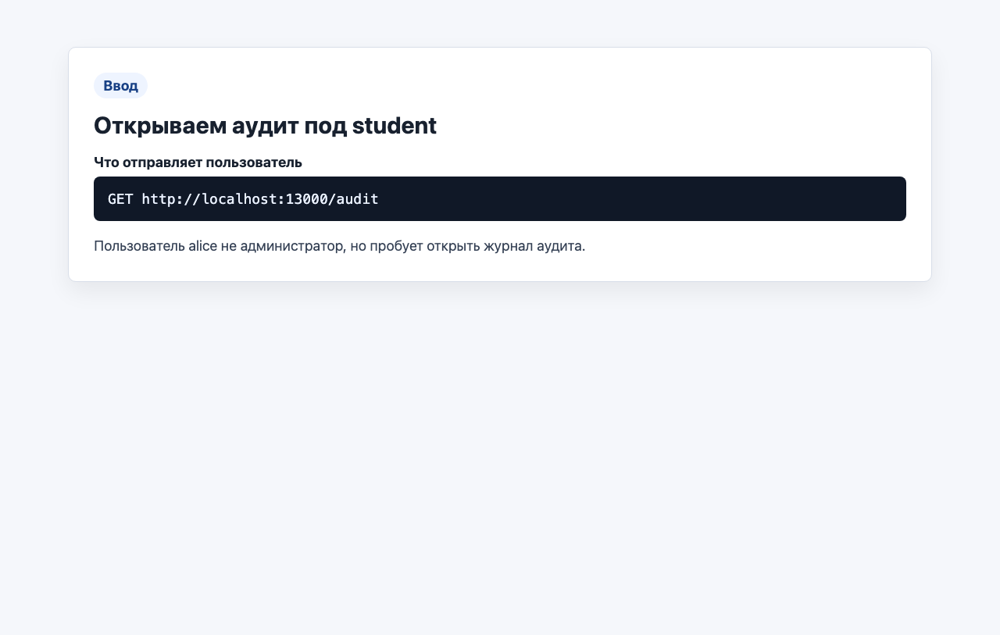

**Скрин результата:**

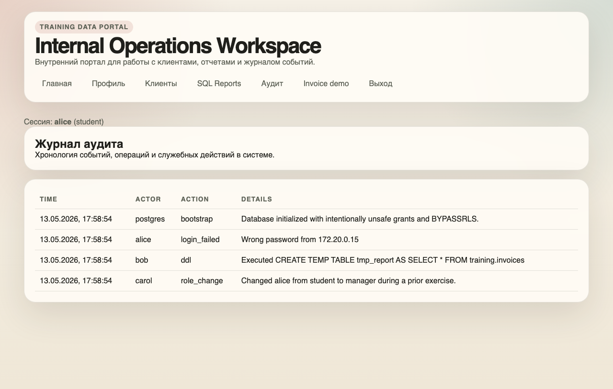

**Как исправить кодом:**

Раздел аудита должен быть доступен только администратору.

```ts
function requireRole(user, roles: string[]) {
	if (!user || !roles.includes(user.role)) {
		error(403, 'Недостаточно прав');
	}
}

export async function load({ locals }) {
	requireRole(locals.user, ['admin']);
	return {
		events: await listAuditEvents()
	};
}
```

## 8. Пользователь может повысить себе роль

В обычной форме профиля поля роли нет, но в запрос можно добавить параметр:

```text
roleName=admin
```

После этого `alice` временно стала `admin`. После проверки роль была возвращена обратно.

**Скрин ввода:**

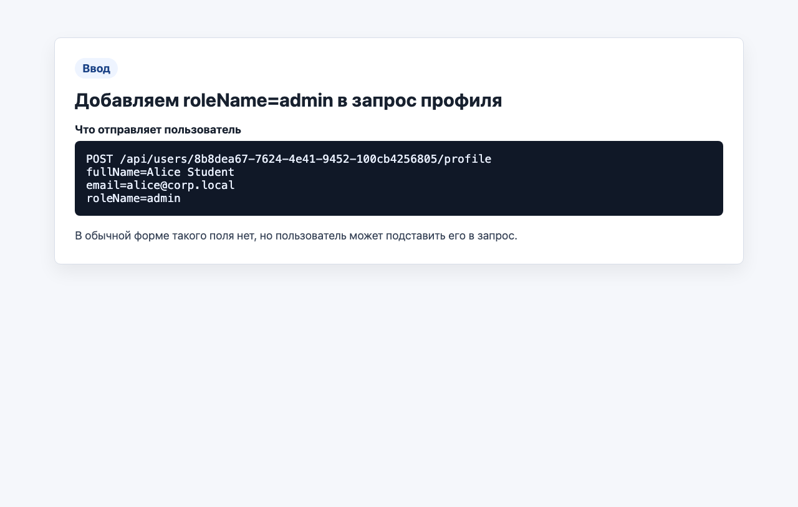

**Скрин результата:**

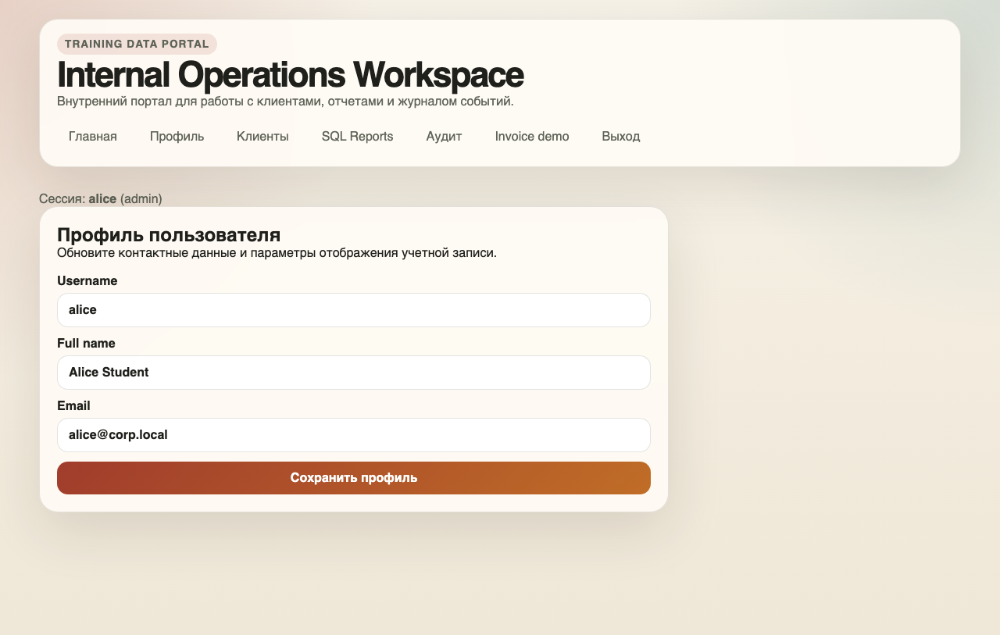

**Как исправить кодом:**

Обычное редактирование профиля должно менять только имя и email. Поле роли из пользовательского запроса нужно игнорировать.

```ts
await pool.query(
	`
		UPDATE training.app_users
		SET full_name = $1,
		    email = $2
		WHERE id = $3
	`,
	[fullName, email, locals.user.id]
);
```

Изменение роли лучше вынести в отдельный обработчик только для администратора.

```ts
if (locals.user?.role !== 'admin') {
	error(403, 'Только администратор может менять роли');
}

await pool.query(
	'UPDATE training.app_users SET role = $1 WHERE id = $2',
	[roleName, userId]
);
```

## 9. Пользователь может изменить чужой профиль

Под пользователем `alice` был отправлен запрос на изменение данных `bob`. Сервер принял запрос. После проверки данные `bob` были восстановлены.

**Скрин ввода:**

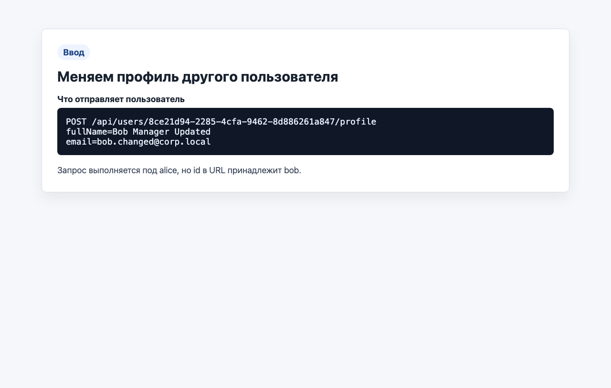

**Скрин результата:**

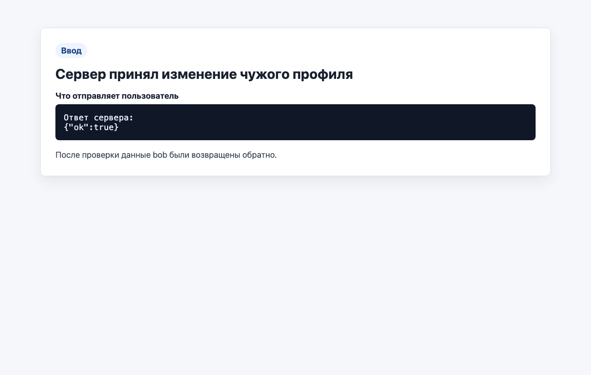

**Как исправить кодом:**

Обычный пользователь должен редактировать только свой профиль.

```ts
if (params.id !== locals.user.id && locals.user.role !== 'admin') {
	error(403, 'Нельзя редактировать чужой профиль');
}
```

## 10. Демо-логин и пароль видны на главной странице

Главная страница без входа показывает рабочие учетные данные `alice / alice123`.

**Скрин ввода:**

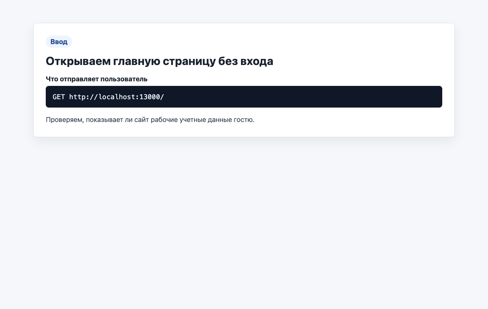

**Скрин результата:**


**Как исправить кодом:**

Не нужно показывать пароль в интерфейсе сайта. Можно оставить только логин или вынести тестовые данные в отдельную инструкцию.

```ts
return {
	demoUsers: [
		{ username: 'alice' }
	]
};
```

## 11. Гость видит внутренние счетчики

Без входа на главной странице видны внутренние счетчики: количество пользователей, клиентов, счетов и записей аудита.

**Скрин ввода:**


**Скрин результата:**

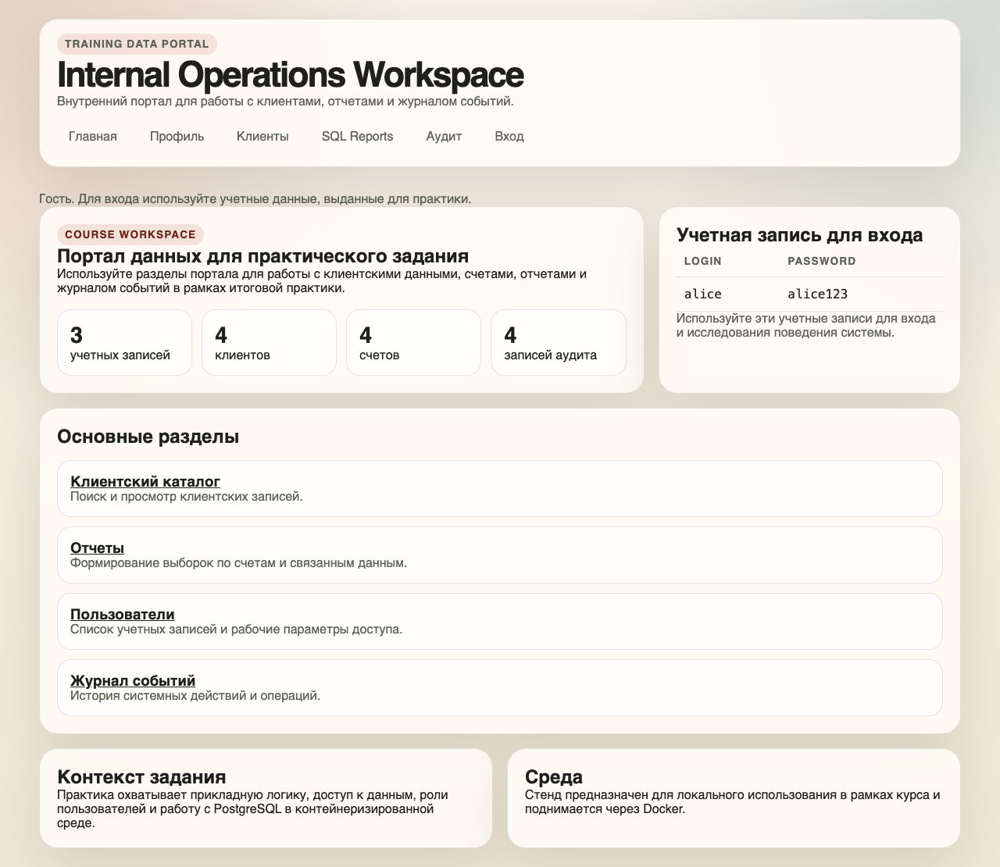

**Как исправить кодом:**

Такие данные лучше показывать только после входа или только администраторам.

```ts
export async function load({ locals }) {
	if (!locals.user) {
		return {
			stats: null
		};
	}

	return {
		stats: await getDashboardStats()
	};
}
```

## 12. Нет ограничения попыток входа

Форма входа позволяет повторять попытки. В реальной системе это облегчает подбор пароля.

**Скрин ввода:**

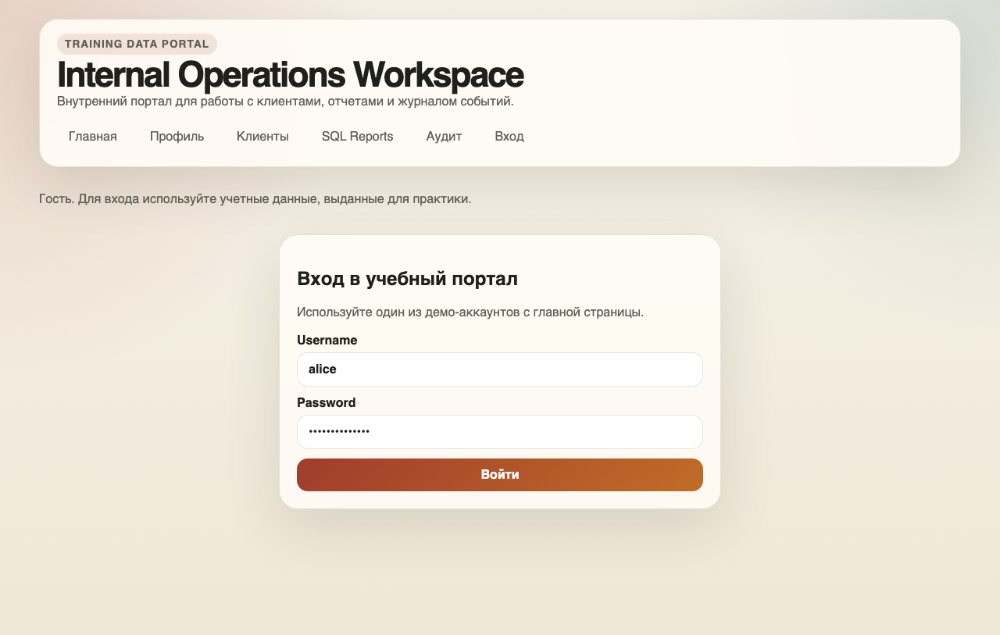

**Скрин результата:**

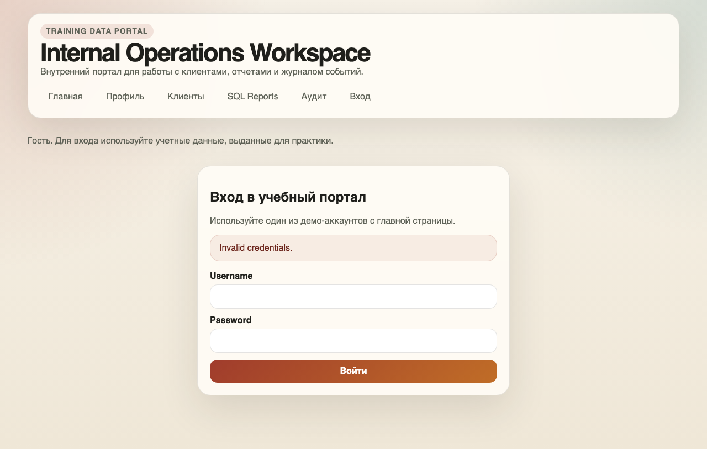

**Как исправить кодом:**

Нужно ограничить количество попыток входа хотя бы по IP и имени пользователя.

```ts
const key = `${clientIp}:${username}`;
const attempts = loginAttempts.get(key) ?? 0;

if (attempts >= 5) {
	return fail(429, {
		error: 'Слишком много попыток. Попробуйте позже.'
	});
}

const session = await login(username, password);

if (!session) {
	loginAttempts.set(key, attempts + 1);
	return fail(401, {
		error: 'Неверный логин или пароль'
	});
}

loginAttempts.delete(key);
```

## Итог

Сайт слишком доверяет данным от пользователя. Через формы, прямые ссылки и подставленные параметры можно получить чужие данные, открыть чужой счет, увидеть аудит и повысить себе роль.

Главные направления исправления:

- все SQL-запросы делать через параметры;
- проверять права на сервере перед каждым действием;
- не принимать роль, чужой id и SQL-условия напрямую из пользовательского запроса;
- скрывать служебные и чувствительные данные от обычных пользователей.
