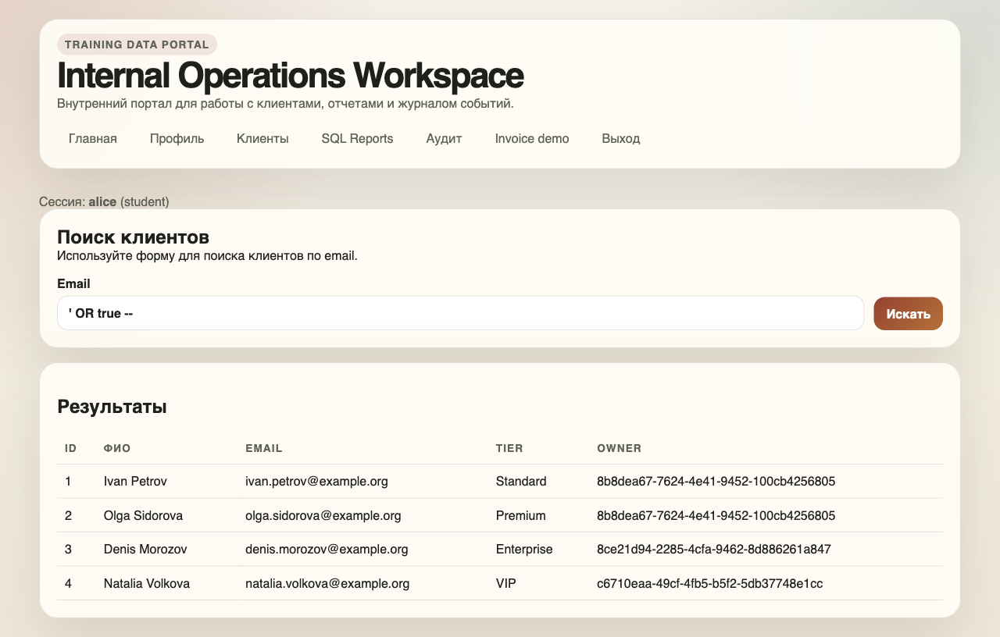

# Отчет по проверке DB_SEC_SITE через сайт

Проверялся учебный сайт `DB_SEC_SITE`: <https://github.com/Wheatgrh/DB_SEC_SITE>.

Сайт был запущен локально. Проверка делалась как обычная работа с сайтом: вход под пользователем, ввод данных в формы, переходы по ссылкам и проверка того, какие данные сайт показывает в ответ.

Основной пользователь для проверки: `alice` с ролью `student`.

## Что удалось подтвердить

| Проверка | Что было сделано | Что получилось |
| --- | --- | --- |
| Поиск клиентов | В поле поиска введено `' OR true --` | Сайт показал всех клиентов, включая чужие записи. |
| Отчеты | В поле SQL Reports введено `true` | Сайт показал все счета, в том числе чужие суммы и `card_hint`. |
| Чужой счет | Открыта прямая ссылка на счет администратора | Обычный пользователь увидел сумму, статус, `card_hint` и внутреннюю заметку. |
| Журнал аудита | Открыт раздел «Аудит» под `alice` | Студент увидел служебные события системы. |
| Профиль | В запрос профиля был добавлен параметр `roleName=admin` | Роль `alice` временно изменилась на `admin`. После проверки роль была возвращена обратно. |
| Чужой профиль | Под `alice` был отправлен запрос на изменение данных `bob` | Данные другого пользователя изменились без прав администратора. После проверки значения были восстановлены. |

## Скриншоты

### Вход под обычным пользователем

Проверка выполнялась под пользователем `alice`, у которого роль `student`.

### SQL-инъекция в поиске клиентов

В поле поиска введено `' OR true --`. После этого сайт вернул не одну найденную запись, а всех клиентов.

### Просмотр всех счетов через отчеты

В поле отчета введено `true`. Сайт вывел счета всех пользователей, включая чужие финансовые данные.

### Просмотр чужого счета

Пользователь `alice` открыл счет администратора `carol` по прямой ссылке. Сайт показал сумму, статус, `card_hint` и внутреннюю заметку.

### Журнал аудита открыт для студента

Раздел «Аудит» доступен обычному пользователю. В нем видны служебные события, которые не должны быть доступны студенту.

### Повышение роли пользователя

После отправки дополнительного параметра `roleName=admin` профиль `alice` начал отображаться с ролью `admin`. Это значит, что сервер доверяет данным, которые пользователь может подставить сам.

## Найденные проблемы

### SQL-инъекция в поиске клиентов

В поиске клиентов можно ввести не обычный email, а SQL-payload. Например, ввод `' OR true --` приводит к тому, что сайт показывает всех клиентов.

**Риск:** обычный пользователь может получить доступ к чужим клиентским данным.

**Как исправить:** запрос к базе должен собираться через параметры, а не через склейку строки. Также нужно проверять на сервере, какие записи имеет право видеть текущий пользователь.

### Небезопасный раздел SQL Reports

В разделе отчетов пользователь может ввести условие, которое напрямую влияет на выборку из базы. При вводе `true` сайт возвращает все счета.

**Риск:** студент может увидеть чужие финансовые данные: суммы, владельцев и `card_hint`.

**Как исправить:** не давать пользователю вводить SQL-фрагменты. Вместо этого лучше сделать обычные фильтры: статус, владелец, диапазон суммы, дата. Пользователь выбирает фильтр, а сервер сам безопасно строит запрос.

### Просмотр чужого счета по прямой ссылке

Если знать ссылку на счет другого пользователя, сайт открывает ее без проверки владельца.

**Риск:** любой вошедший пользователь может увидеть чужой счет, сумму, статус и внутренние заметки.

**Как исправить:** перед показом счета сервер должен проверять, что счет принадлежит текущему пользователю, либо что у пользователя есть роль менеджера или администратора.

### Аудит доступен обычному пользователю

Пользователь `alice` с ролью `student` может открыть журнал аудита.

**Риск:** в журнале видны служебные события, действия других пользователей и детали работы системы. Такая информация помогает лучше понимать внутреннее устройство приложения и упрощает дальнейшие атаки.

**Как исправить:** журнал аудита должен быть доступен только администратору.

### Можно повысить свою роль

В обычной форме профиля поля роли нет, но сервер все равно принимает параметр `roleName`. Если отправить `roleName=admin`, роль пользователя меняется.

**Риск:** обычный пользователь может сделать себя администратором.

**Как исправить:** изменение роли нужно вынести в отдельное административное действие. Сервер должен игнорировать роль из обычной формы профиля и проверять права пользователя перед любым изменением роли.

### Можно изменить чужой профиль

Под пользователем `alice` удалось отправить запрос на изменение данных `bob`.

**Риск:** пользователь может менять чужие данные, если узнает идентификатор другого пользователя.

**Как исправить:** обычный пользователь должен иметь возможность редактировать только свой профиль. Изменение чужих профилей должно быть доступно только администратору.

## Итог

Главная проблема сайта в том, что он слишком сильно доверяет данным от пользователя. Через обычные формы и ссылки можно получить чужие данные, открыть чужой счет, увидеть аудит и даже повысить себе роль.

Для исправления нужно сделать три вещи: безопасно работать с SQL, проверять права на сервере перед каждым действием и не доверять данным, которые пользователь может подставить сам.
