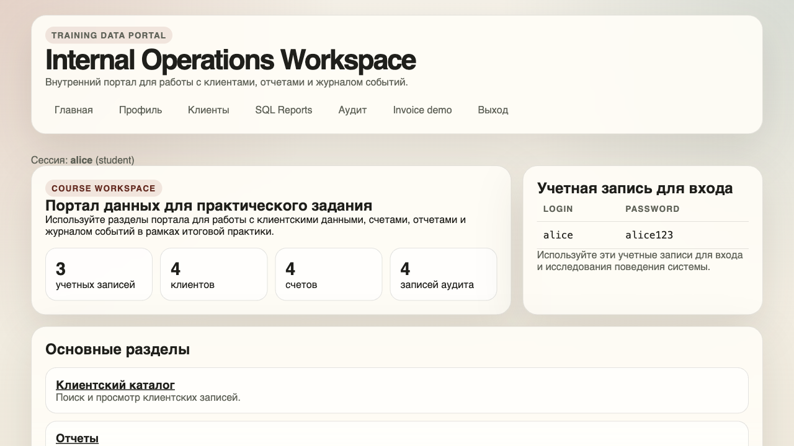
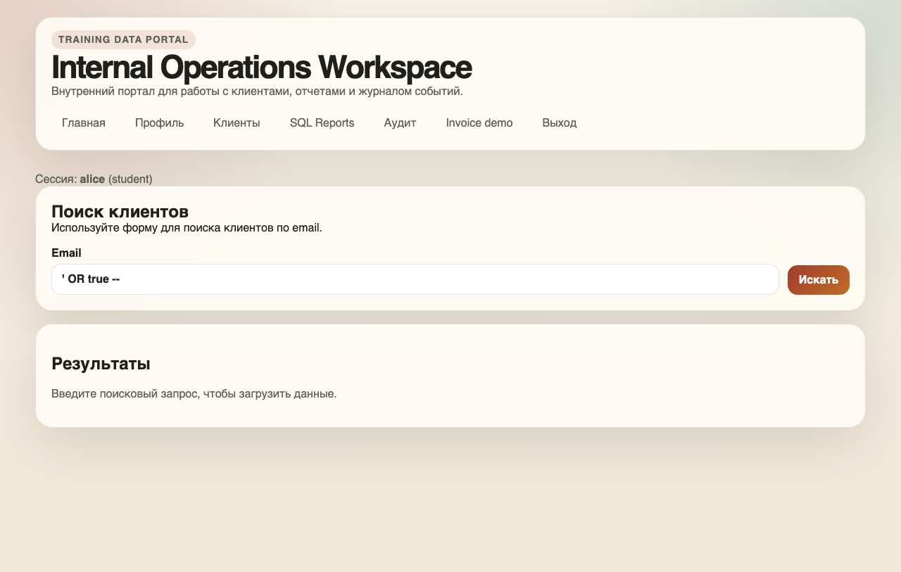
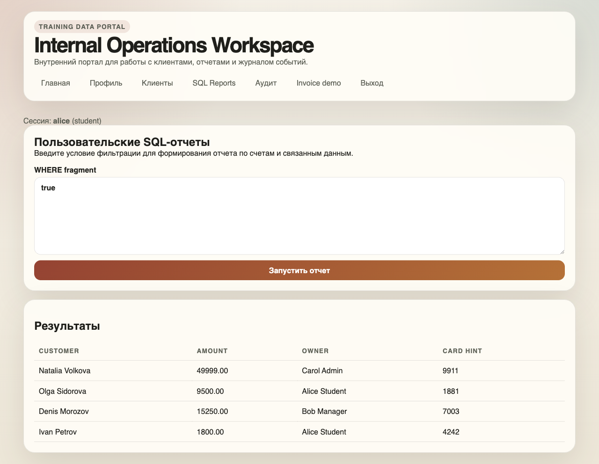
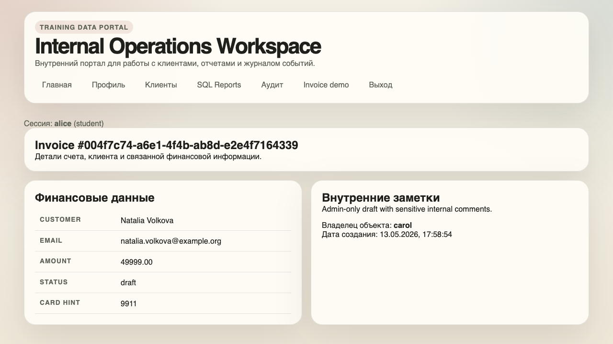
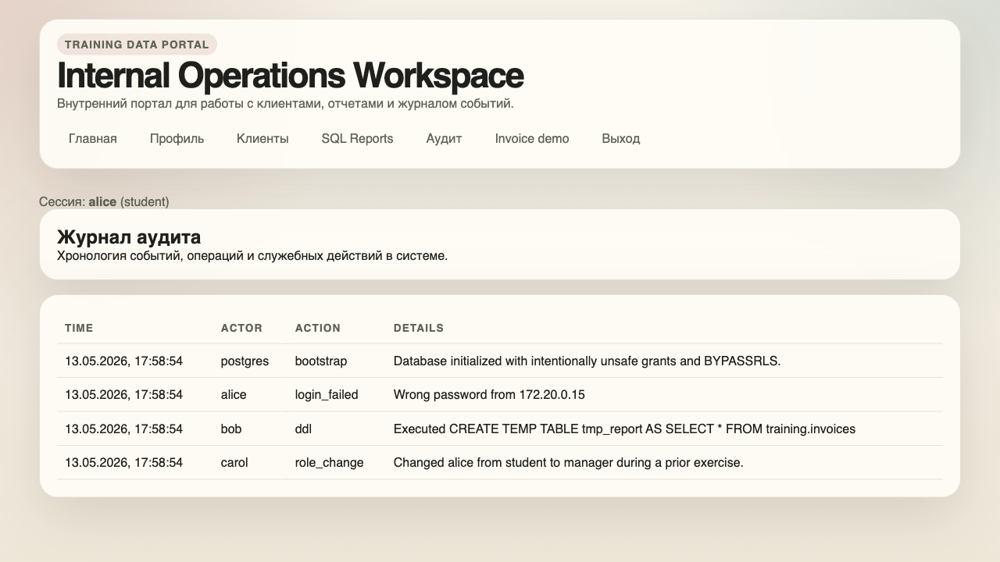
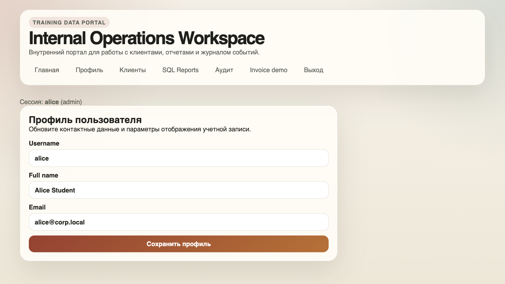

# Отчет по проверке DB_SEC_SITE через сайт

Проверялся учебный сайт `DB_SEC_SITE`: <https://github.com/Wheatgrh/DB_SEC_SITE>.

Сайт был запущен локально. Я проверял его как обычный пользователь: заходил в браузере, вводил данные в формы, открывал ссылки и смотрел, какие данные сайт показывает в ответ. Исходные файлы сайта не менялись.

Основной пользователь для проверки: `alice` с ролью `student`.

## Что удалось подтвердить

| Проверка | Что было сделано | Что получилось |
| --- | --- | --- |
| Поиск клиентов | В поле поиска введено `' OR true --` | Сайт показал всех клиентов, включая чужие записи. |
| SQL Reports | В поле отчета введено `true` | Сайт показал все счета, в том числе чужие суммы и `card_hint`. |
| Ошибка в SQL Reports | В поле отчета можно ввести некорректное условие | Сайт возвращает техническую ошибку, а не обычное сообщение. |
| Чужой счет | Открыта прямая ссылка на счет администратора | Обычный пользователь увидел сумму, статус, `card_hint` и внутреннюю заметку. |
| Лишние данные в счете | Открыт чужой счет через интерфейс | Видны внутренние заметки и банковская подсказка `card_hint`. |
| Журнал аудита | Открыт раздел «Аудит» под `alice` | Студент увидел служебные события системы. |
| Повышение роли | В запрос профиля добавлен параметр `roleName=admin` | Роль `alice` временно изменилась на `admin`. После проверки роль была возвращена обратно. |
| Чужой профиль | Под `alice` был отправлен запрос на изменение данных `bob` | Данные другого пользователя изменились без прав администратора. После проверки значения были восстановлены. |
| Демо-логин на главной | Главная страница открыта без входа | Сайт сам показывает логин и пароль `alice / alice123`. |
| Слабая модель паролей | Используется простой учебный пароль | Такой пароль легко подобрать и нельзя оставлять в реальной системе. |
| Сессия | После входа выставляется cookie `session_id` | Для production нужно усилить cookie и срок жизни сессии. |
| Перебор пароля | Форма входа позволяет повторять попытки | Нужен лимит попыток входа, иначе пароль можно подбирать автоматически. |

## Скриншоты

### Вход под обычным пользователем

Проверка выполнялась под пользователем `alice`, у которого роль `student`.



### Ввод SQL-инъекции в поиск

Первый скрин показывает сам ввод payload в поле поиска. Форма еще не отправлена.



### Результат SQL-инъекции

После отправки формы сайт показал всех клиентов, хотя обычный поиск должен был вернуть только подходящие записи.


### Просмотр всех счетов через отчеты

В поле отчета введено `true`. Сайт вывел счета всех пользователей, включая чужие финансовые данные.



### Просмотр чужого счета

Пользователь `alice` открыл счет администратора `carol` по прямой ссылке. Сайт показал сумму, статус, `card_hint` и внутреннюю заметку.



### Журнал аудита открыт для студента

Раздел «Аудит» доступен обычному пользователю. В нем видны служебные события, которые не должны быть доступны студенту.



### Повышение роли пользователя

После отправки дополнительного параметра `roleName=admin` профиль `alice` начал отображаться с ролью `admin`. Это значит, что сервер доверяет данным, которые пользователь может подставить сам.



## Найденные проблемы: 12 пунктов

### SQL-инъекция в поиске клиентов

В поиске клиентов можно ввести не обычный email, а SQL-payload. Ввод `' OR true --` приводит к тому, что сайт показывает всех клиентов.

**Риск:** обычный пользователь получает доступ к чужим клиентским данным.

**Как исправить:** запрос к базе должен использовать параметры, а не склейку строки.

```ts
const result = await pool.query(
	`
		SELECT id, full_name, email, tier, owner_user_id
		FROM training.customers
		WHERE email ILIKE '%' || $1 || '%'
		ORDER BY id
	`,
	[search.trim()]
);
```

### Небезопасный раздел SQL Reports

В разделе отчетов пользователь может ввести условие, которое напрямую влияет на выборку. При вводе `true` сайт возвращает все счета.

**Риск:** студент видит чужие финансовые данные: суммы, владельцев и `card_hint`.

**Как исправить:** не принимать SQL-фрагмент от пользователя. Лучше сделать обычные фильтры и собирать запрос только из разрешенных параметров.

```ts
const allowedStatuses = new Set(['paid', 'pending', 'overdue', 'draft']);

if (!allowedStatuses.has(status)) {
	error(400, 'Некорректный статус');
}

const result = await pool.query(
	`
		SELECT customer_name, amount, owner_name
		FROM training.safe_invoice_report
		WHERE status = $1
	`,
	[status]
);
```

### Технические ошибки показываются пользователю

Если в отчете ввести неправильное условие, сайт может показать текст ошибки базы. Для обычного пользователя это лишняя информация.

**Риск:** по ошибкам проще понять структуру базы и подобрать рабочую инъекцию.

**Как исправить:** пользователю показывать обычное сообщение, а технические детали писать только в серверный лог.

```ts
try {
	const results = await runReport(filters);
	return { results };
} catch (err) {
	console.error('Report failed', err);
	return fail(400, {
		error: 'Не удалось сформировать отчет. Проверьте параметры фильтра.'
	});
}
```

### Просмотр чужого счета по прямой ссылке

Если знать ссылку на счет другого пользователя, сайт открывает ее без проверки владельца.

**Риск:** любой вошедший пользователь может увидеть чужой счет, сумму, статус и внутренние заметки.

**Как исправить:** перед показом счета проверять владельца или роль.

```ts
const result = await pool.query(
	`
		SELECT *
		FROM training.invoices
		WHERE id = $1
		  AND (
		    owner_user_id = $2
		    OR $3 IN ('manager', 'admin')
		  )
	`,
	[invoiceId, currentUser.id, currentUser.role]
);

if (!result.rows[0]) {
	error(404, 'Счет не найден');
}
```

### Лишние данные в карточке счета

В счете обычному пользователю показываются `card_hint` и внутренние заметки. Даже если пользователь имеет право видеть сам счет, не всегда нужно показывать все поля.

**Риск:** раскрываются финансовые и служебные данные.

**Как исправить:** отдавать разные наборы полей для разных ролей.

```ts
const sql =
	user.role === 'admin'
		? `
			SELECT amount, status, card_hint, notes
			FROM training.invoices
			WHERE id = $1
		`
		: `
			SELECT amount, status
			FROM training.invoices
			WHERE id = $1
		`;

const result = await pool.query(sql, [invoiceId]);
```

### Аудит доступен обычному пользователю

Пользователь `alice` с ролью `student` может открыть журнал аудита.

**Риск:** в журнале видны служебные события, действия других пользователей и детали работы системы.

**Как исправить:** добавить проверку роли на сервере.

```ts
function requireRole(user, roles: string[]) {
	if (!user || !roles.includes(user.role)) {
		error(403, 'Недостаточно прав');
	}
}

export async function load({ locals }) {
	requireRole(locals.user, ['admin']);
	return {
		events: await listAuditEvents()
	};
}
```

### Можно повысить свою роль

В обычной форме профиля поля роли нет, но сервер принимает параметр `roleName`. Если отправить `roleName=admin`, роль пользователя меняется.

**Риск:** обычный пользователь может сделать себя администратором.

**Как исправить:** обычный профиль должен менять только имя и email. Роль из пользовательской формы нужно игнорировать.

```ts
await pool.query(
	`
		UPDATE training.app_users
		SET full_name = $1,
		    email = $2
		WHERE id = $3
	`,
	[fullName, email, locals.user.id]
);
```

Изменение роли лучше вынести в отдельное действие только для администратора.

```ts
if (locals.user?.role !== 'admin') {
	error(403, 'Только администратор может менять роли');
}

await pool.query(
	'UPDATE training.app_users SET role = $1 WHERE id = $2',
	[roleName, userId]
);
```

### Можно изменить чужой профиль

Под пользователем `alice` удалось отправить запрос на изменение данных `bob`.

**Риск:** пользователь может менять чужие данные, если узнает идентификатор другого пользователя.

**Как исправить:** обычный пользователь должен редактировать только свой профиль.

```ts
if (params.id !== locals.user.id && locals.user.role !== 'admin') {
	error(403, 'Нельзя редактировать чужой профиль');
}
```

### Демо-логин и пароль показаны на главной странице

Главная страница показывает учетные данные `alice / alice123`. Для учебного стенда это удобно, но как уязвимость это тоже стоит отметить.

**Риск:** любой посетитель сразу получает рабочий логин и пароль.

**Как исправить:** не показывать пароли на странице. Для учебной работы можно вынести их в отдельную инструкцию, а не в интерфейс сайта.

```ts
return {
	demoUsers: [
		{ username: 'alice' }
	]
};
```

### Простые пароли и небезопасное хранение паролей

Пароль `alice123` слишком простой. В нормальном приложении пароль нельзя хранить и проверять как обычный текст.

**Риск:** пароль легко подобрать, а при утечке базы будут видны реальные пароли.

**Как исправить:** хранить хеш пароля и проверять пароль через безопасный алгоритм, например Argon2id.

```ts
import { hash, verify } from '@node-rs/argon2';

const passwordHash = await hash(password);

const isValid = await verify(user.password_hash, passwordFromForm);
if (!isValid) {
	return fail(401, { error: 'Неверный логин или пароль' });
}
```

### Сессию нужно усилить

После входа сайт выдает cookie `session_id`. Для реальной системы важно ограничивать срок жизни сессии и ставить безопасные параметры cookie.

**Риск:** если session id украдут, им можно пользоваться до удаления сессии.

**Как исправить:** добавить срок действия сессии на сервере и включать `secure` для HTTPS.

```ts
cookies.set('session_id', session.sessionId, {
	path: '/',
	httpOnly: true,
	sameSite: 'strict',
	secure: process.env.NODE_ENV === 'production',
	maxAge: 60 * 60
});
```

В базе у сессии тоже должен быть срок действия.

```sql
ALTER TABLE training.sessions
ADD COLUMN expires_at timestamptz NOT NULL DEFAULT now() + interval '1 hour';
```

### Нет ограничения попыток входа

Форма входа позволяет повторять попытки. Для учебного стенда это не критично, но в реальной системе это облегчает подбор пароля.

**Риск:** пароль можно подбирать автоматически.

**Как исправить:** добавить ограничение попыток входа хотя бы по IP и имени пользователя.

```ts
const key = `${clientIp}:${username}`;
const attempts = loginAttempts.get(key) ?? 0;

if (attempts >= 5) {
	return fail(429, { error: 'Слишком много попыток. Попробуйте позже.' });
}

const session = await login(username, password);
if (!session) {
	loginAttempts.set(key, attempts + 1);
	return fail(401, { error: 'Неверный логин или пароль' });
}

loginAttempts.delete(key);
```

## Итог

Главная проблема сайта в том, что он слишком сильно доверяет данным от пользователя. Через обычные формы, параметры запроса и прямые ссылки можно получить чужие данные, открыть чужой счет, увидеть аудит и даже повысить себе роль.

Если коротко, исправления идут в трех направлениях:

- безопасно работать с SQL;
- проверять права на сервере перед каждым действием;
- не доверять данным, которые пользователь может подставить сам.
