# Отчет по проверке DB_SEC_SITE через интерфейс сайта

Проверялся учебный сайт `DB_SEC_SITE`: <https://github.com/Wheatgrh/DB_SEC_SITE>.

Сайт был запущен локально на `http://localhost:13000`. Проверка велась как от лица обычного пользователя `alice / alice123` с ролью `student`: через страницы сайта, формы `Клиенты`, `SQL Reports`, `Профиль` и переходы по меню. Исходные файлы учебного приложения во время проверки не менялись.

Для каждого пункта ниже есть два скриншота: сначала что вводилось или менялось в браузере, затем что сайт показал после отправки. После опасных проверок данные были возвращены обратно: `alice` снова `student`, профиль `bob` восстановлен.

## 1. Поиск клиентов возвращает все записи через SQL-инъекцию

В разделе `Клиенты` в поле Email был введен payload:

```sql
' OR true --
```

Обычный поиск должен искать email, но из-за SQL-инъекции условие стало всегда истинным. В результате `alice` увидела всех клиентов, включая записи других владельцев.

**Что вводилось:**


**Что получилось:**

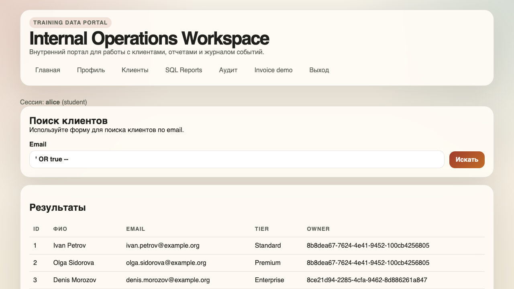

**Риск:** любой пользователь может обойти фильтр и увидеть чужие клиентские записи.

**Как исправить кодом:**

```ts
const search = q.trim();

const result = await pool.query(
	`
		SELECT id, full_name, email, tier, owner_user_id
		FROM training.customers
		WHERE email ILIKE '%' || $1 || '%'
		ORDER BY id
	`,
	[search]
);
```

## 2. Через поиск клиентов вытаскиваются пользователи, роли и пароли

В то же поле Email был введен payload с `UNION SELECT`:

```sql
x%' UNION SELECT -3, username, password, role, id FROM training.app_users --
```

Сайт вывел данные из таблицы пользователей прямо в таблице клиентов: логины, роли и пароли `alice`, `bob`, `carol`.

**Что вводилось:**

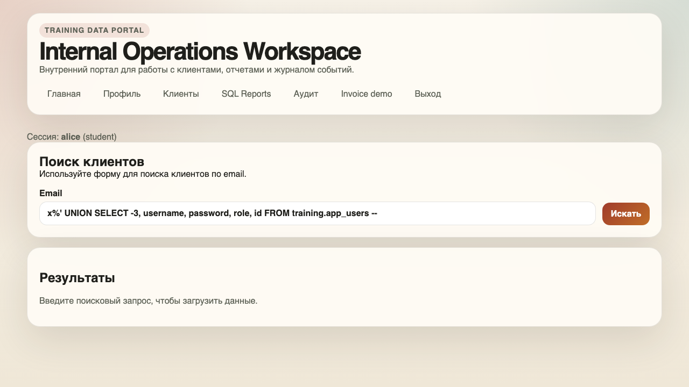

**Что получилось:**

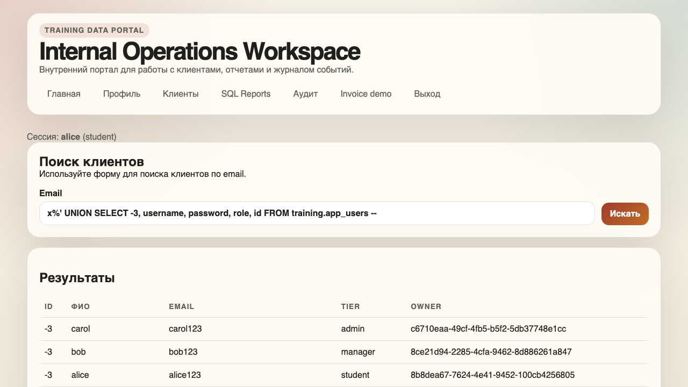

**Риск:** компрометация учетных записей. Если такие пароли повторяются где-то еще, атака выходит за пределы одного учебного сайта.

**Как исправить кодом:**

```ts
const result = await pool.query(
	`
		SELECT id, full_name, email, tier, owner_user_id
		FROM training.customers
		WHERE email ILIKE '%' || $1 || '%'
		ORDER BY id
	`,
	[search]
);
```

Пароли также нельзя хранить открытым текстом.

```ts
import bcrypt from 'bcryptjs';

const user = await pool.query(
	'SELECT id, username, password_hash, role FROM training.app_users WHERE username = $1',
	[username]
);

const ok = user.rows[0] && await bcrypt.compare(password, user.rows[0].password_hash);
```

## 3. Через поиск клиентов вытаскиваются счета

В поле Email был введен еще один `UNION SELECT`, но уже по таблице счетов:

```sql
x%' UNION SELECT -4, i.id::text, i.amount::text, i.status, i.owner_user_id FROM training.invoices i --
```

В результате в таблице клиентов появились id счетов, суммы, статусы и владельцы.

**Что вводилось:**

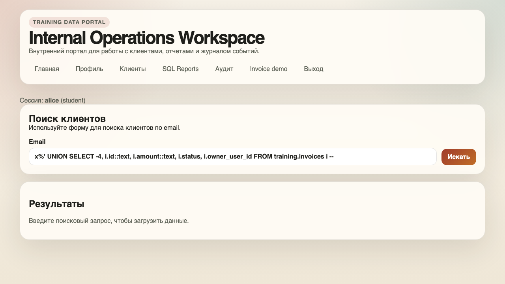

**Что получилось:**

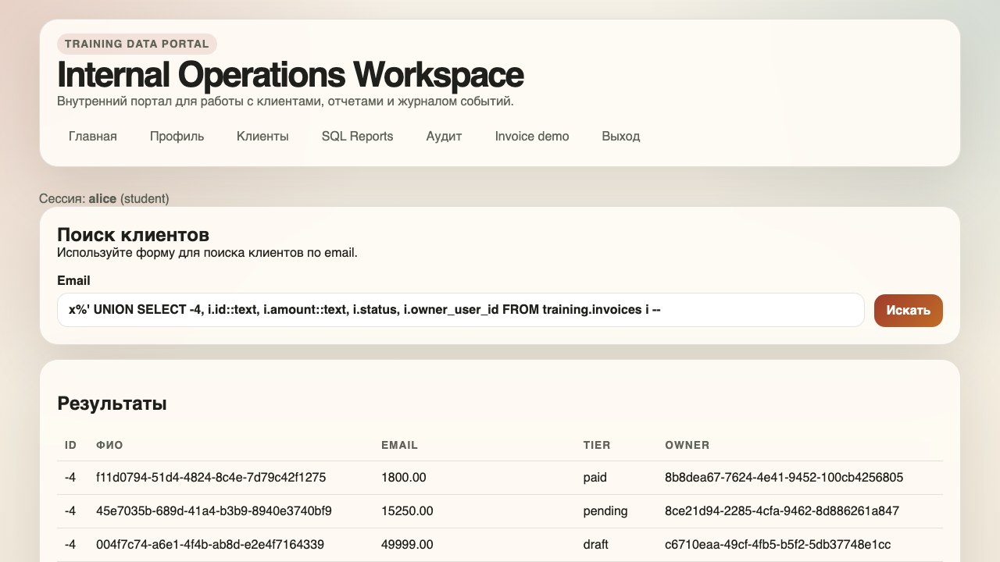

**Риск:** через одну форму можно читать данные из других таблиц, хотя интерфейс для этого вообще не предназначен.

**Как исправить кодом:**

Помимо параметров в SQL, приложению нужен отдельный пользователь БД с минимальными правами. Если экрану клиентов не нужны счета, у него не должно быть прямого доступа к таблице `invoices`.

```sql
REVOKE ALL ON training.invoices FROM app_user;
REVOKE ALL ON training.app_users FROM app_user;

GRANT SELECT (id, full_name, email, tier, owner_user_id)
ON training.customers
TO app_user;
```

## 4. Ошибка в поиске клиентов ломает страницу

В поле Email был введен одинарный апостроф:

```sql
'
```

Страница не обработала ошибку нормально и вернула `500 Internal Error`.

**Что вводилось:**

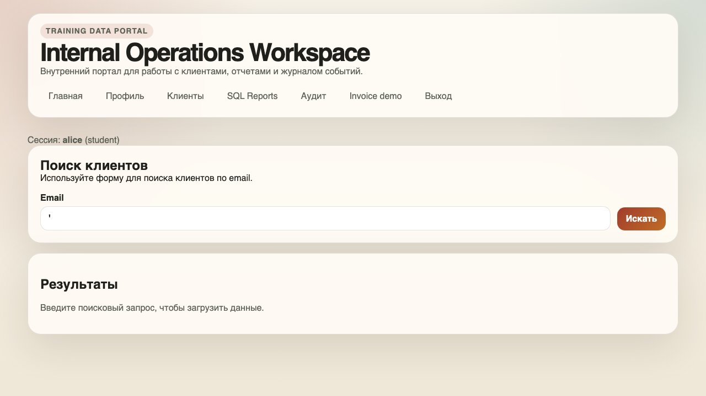

**Что получилось:**

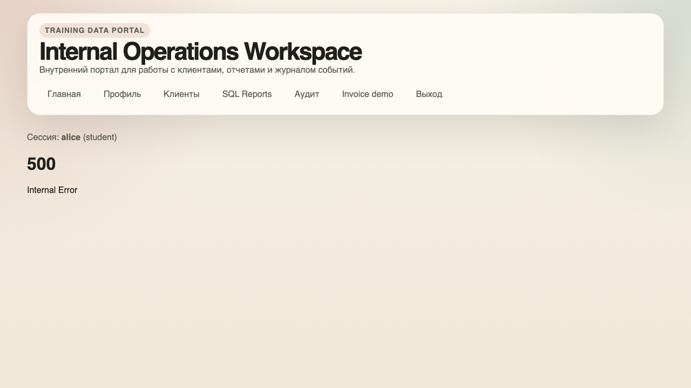

**Риск:** пользователь может ломать страницу одним символом. Для атакующего это еще и сигнал, что ввод попадает в SQL небезопасно.

**Как исправить кодом:**

```ts
try {
	const result = await searchCustomers(search);
	return { q: search, customers: result.rows };
} catch (err) {
	console.error('Customer search failed', err);
	return {
		q: search,
		customers: [],
		error: 'Поиск временно недоступен. Попробуйте другой запрос.'
	};
}
```

## 5. SQL Reports показывает все счета по условию `true`

В разделе `SQL Reports` было введено:

```sql
true
```

Такой фильтр всегда выполняется. Сайт вывел все счета, всех владельцев и `card_hint`.

**Что вводилось:**


**Что получилось:**


**Риск:** обычный студент получает отчет по всем клиентам и счетам без ограничения по своему пользователю.

**Как исправить кодом:**

Не нужно давать пользователю писать SQL. Лучше сделать обычные фильтры и собирать запрос на сервере.

```ts
const allowedStatuses = new Set(['paid', 'pending', 'overdue', 'draft']);

if (!allowedStatuses.has(status)) {
	error(400, 'Некорректный статус');
}

const result = await pool.query(
	`
		SELECT c.full_name, i.amount, u.full_name AS owner_name
		FROM training.invoices i
		JOIN training.customers c ON c.id = i.customer_id
		JOIN training.app_users u ON u.id = i.owner_user_id
		WHERE i.status = $1
		  AND i.owner_user_id = $2
	`,
	[status, locals.user.id]
);
```

## 6. SQL Reports показывает счет администратора

В поле отчета был введен фильтр по пользователю `carol`:

```sql
u.username = 'carol'
```

`alice` получила счет администратора `carol`, хотя это другой владелец данных.

**Что вводилось:**

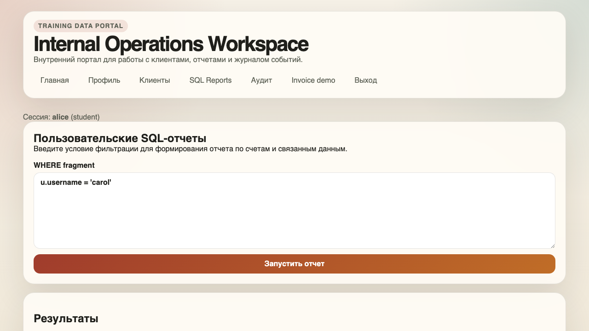

**Что получилось:**

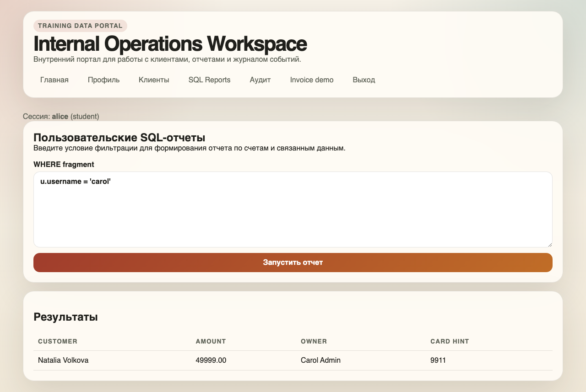

**Риск:** нарушена изоляция данных между пользователями. Любой может подобрать имя владельца и посмотреть его счета.

**Как исправить кодом:**

Ограничение по текущему пользователю должно добавляться сервером, а не приходить из формы.

```ts
const result = await pool.query(
	`
		SELECT c.full_name, i.amount, u.full_name AS owner_name
		FROM training.invoices i
		JOIN training.customers c ON c.id = i.customer_id
		JOIN training.app_users u ON u.id = i.owner_user_id
		WHERE i.owner_user_id = $1
	`,
	[locals.user.id]
);
```

Для администраторов можно сделать отдельную ветку с явной проверкой роли.

```ts
if (locals.user.role !== 'admin') {
	filters.push(`i.owner_user_id = $${values.length + 1}`);
	values.push(locals.user.id);
}
```

## 7. SQL Reports позволяет проверять данные из таблицы пользователей

В поле отчета был введен boolean-based payload:

```sql
EXISTS (SELECT 1 FROM training.app_users WHERE username = 'alice' AND password = 'alice123')
```

Если условие истинно, отчет возвращает строки. Так можно проверять существование пользователей и паролей через реакцию страницы.

**Что вводилось:**

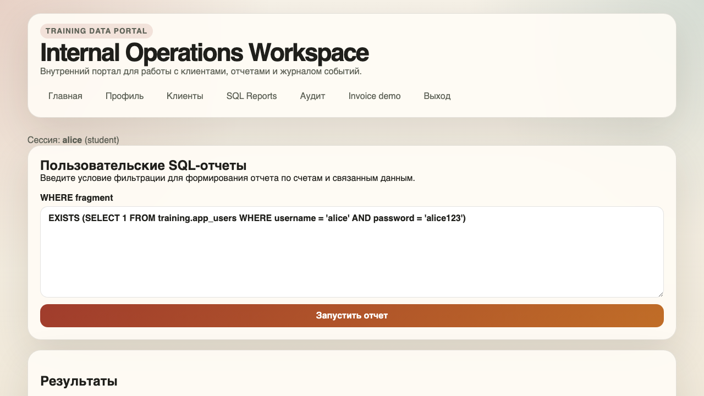

**Что получилось:**

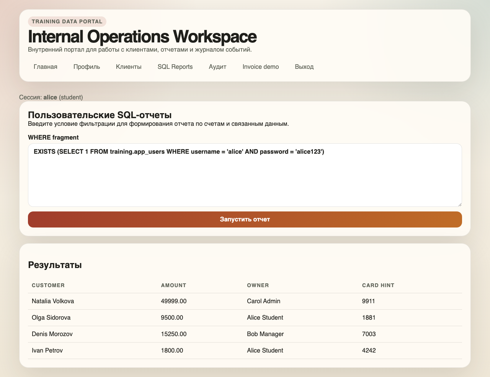

**Риск:** даже если данные не выводятся напрямую, их можно угадывать через `true/false`-условия.

**Как исправить кодом:**

Причина та же: пользователь не должен управлять SQL-условием. Для отчетов нужен ограниченный набор параметров.

```ts
type ReportFilter = {
	status?: 'paid' | 'pending' | 'overdue' | 'draft';
	minAmount?: number;
};

const values: unknown[] = [locals.user.id];
const where = ['i.owner_user_id = $1'];

if (filter.status) {
	values.push(filter.status);
	where.push(`i.status = $${values.length}`);
}

if (filter.minAmount) {
	values.push(filter.minAmount);
	where.push(`i.amount >= $${values.length}`);
}
```

## 8. SQL Reports раскрывает `card_hint`

В SQL Reports был введен фильтр:

```sql
i.status = 'draft'
```

Отчет показал черновой счет администратора и поле `card_hint = 9911`.

**Что вводилось:**


**Что получилось:**

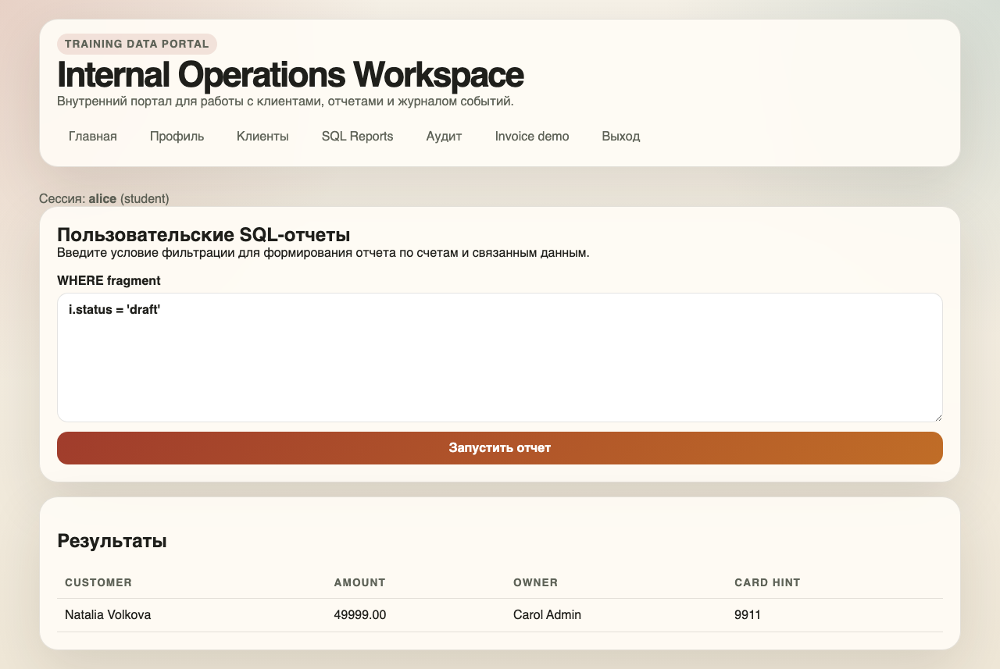

**Риск:** даже короткий фрагмент платежных данных не стоит показывать всем ролям. Такие поля должны быть маскированы или доступны только ограниченному кругу.

**Как исправить кодом:**

```ts
const canSeeCardHint = locals.user.role === 'admin';

const result = await pool.query(
	`
		SELECT
			c.full_name,
			i.amount,
			u.full_name AS owner_name,
			CASE WHEN $2::boolean THEN i.card_hint ELSE '****' END AS card_hint
		FROM training.invoices i
		JOIN training.customers c ON c.id = i.customer_id
		JOIN training.app_users u ON u.id = i.owner_user_id
		WHERE i.owner_user_id = $1
	`,
	[locals.user.id, canSeeCardHint]
);
```

## 9. SQL Reports раскрывает техническую ошибку PostgreSQL

В поле отчета было введено несуществующее поле:

```sql
not_existing_column = 1
```

Сайт показал текст ошибки PostgreSQL: `column "not_existing_column" does not exist`.

**Что вводилось:**

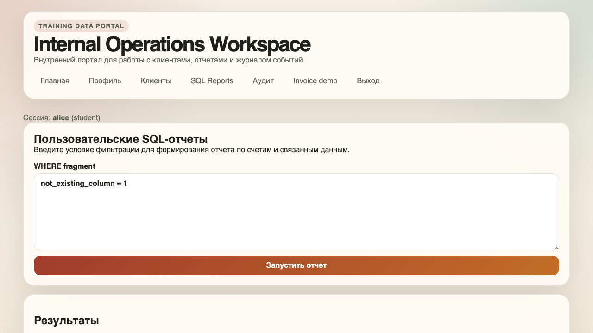

**Что получилось:**

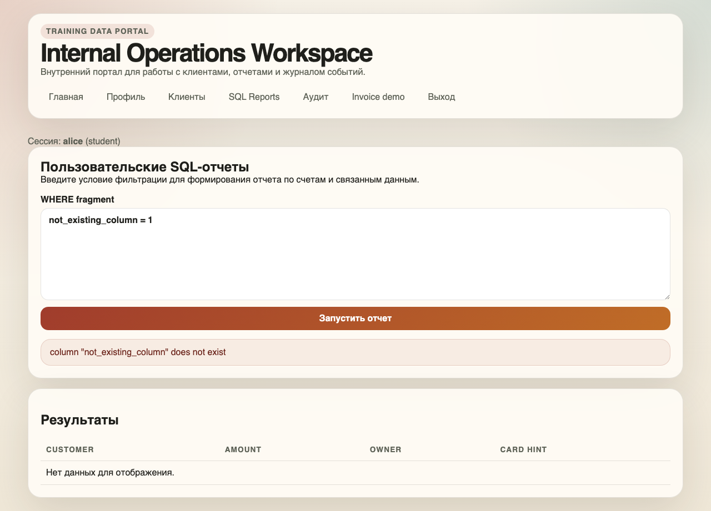

**Риск:** подробные ошибки помогают подбирать названия таблиц, колонок и рабочие payload.

**Как исправить кодом:**

```ts
try {
	const results = await runSafeReport(filter);
	return { results };
} catch (err) {
	console.error('Report failed', err);
	return fail(400, {
		error: 'Не удалось сформировать отчет. Проверьте параметры фильтра.'
	});
}
```

## 10. Пользователь может повысить себе роль через `roleName=admin`

В обычной форме профиля поля роли нет. Через DevTools в браузере в форму был добавлен параметр:

```text
roleName=admin
```

После сохранения профиль `alice` перезагрузился уже с ролью `admin`.

**Что вводилось:**

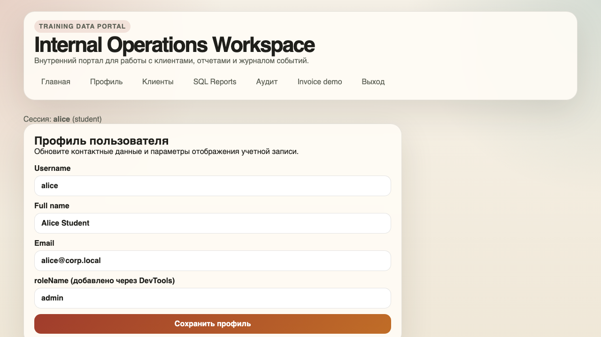

**Что получилось:**

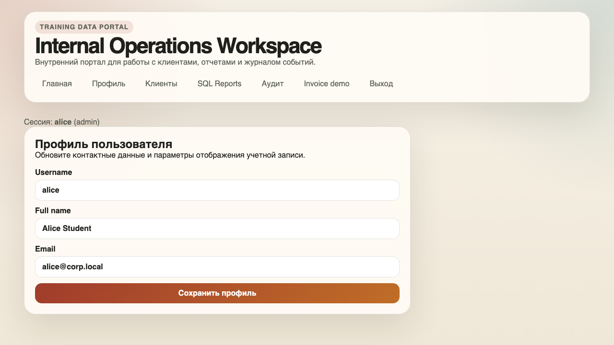

**Риск:** обычный пользователь может сам выдать себе административные права.

**Как исправить кодом:**

Обычный endpoint профиля должен принимать только имя и email. Роль из пользовательского запроса нужно игнорировать.

```ts
export async function POST({ locals, request }) {
	if (!locals.user) {
		redirect(303, '/login');
	}

	const form = await request.formData();
	const fullName = String(form.get('fullName') ?? '').trim();
	const email = String(form.get('email') ?? '').trim();

	await updateUserProfile(locals.user.id, { fullName, email });

	return json({ ok: true });
}
```

Изменение роли нужно выносить в отдельный admin-only обработчик.

```ts
if (locals.user.role !== 'admin') {
	error(403, 'Только администратор может менять роли');
}
```

## 11. Пользователь может изменить чужой профиль

Через DevTools был изменен целевой id запроса профиля: вместо своего id `alice` отправила обновление на id пользователя `bob`.

В форму были подставлены новые значения:

```text
fullName=Bob Changed From Alice
email=bob.changed@corp.local
```

После отправки запрос был принят. Для проверки был выполнен вход под `bob`, и его профиль действительно оказался изменен.

**Что вводилось:**

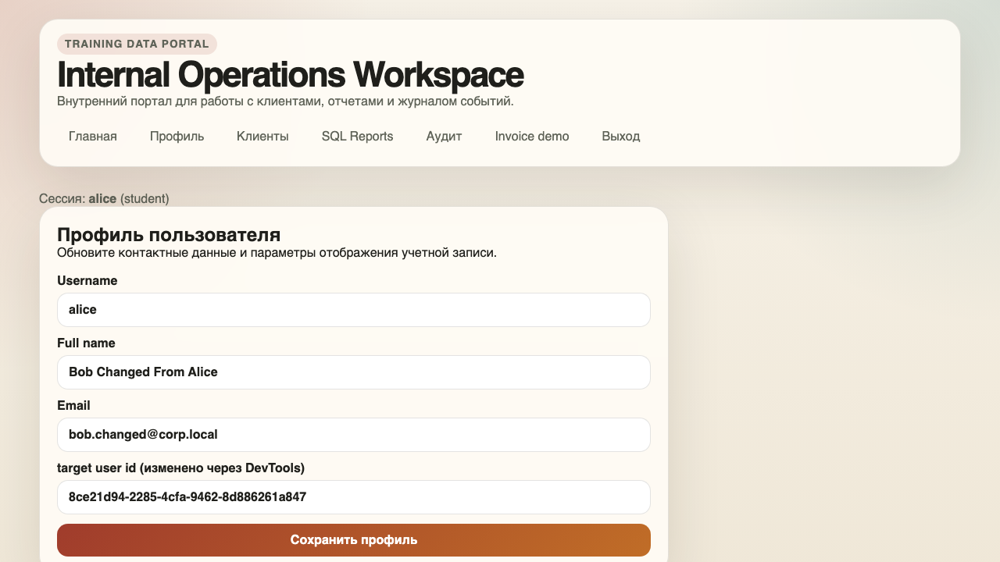

**Что получилось:**


**Риск:** это IDOR. Пользователь может менять чужие данные, если знает или угадывает id.

**Как исправить кодом:**

```ts
export async function POST({ locals, params, request }) {
	if (!locals.user) {
		redirect(303, '/login');
	}

	if (params.id !== locals.user.id && locals.user.role !== 'admin') {
		error(403, 'Нельзя редактировать чужой профиль');
	}

	const form = await request.formData();
	const fullName = String(form.get('fullName') ?? '').trim();
	const email = String(form.get('email') ?? '').trim();

	await updateUserProfile(params.id, { fullName, email });

	return json({ ok: true });
}
```

## 12. Студент может открыть журнал аудита

Пользователь `alice` с ролью `student` открыл пункт меню `Аудит`.

**Что делалось:**

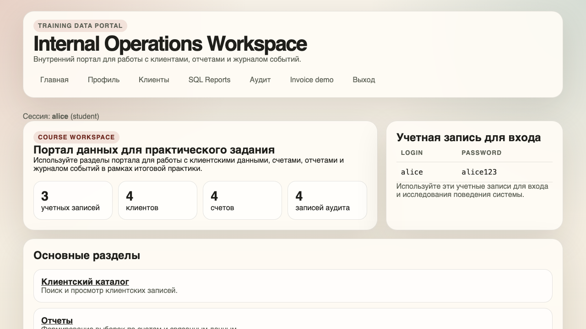

**Что получилось:**

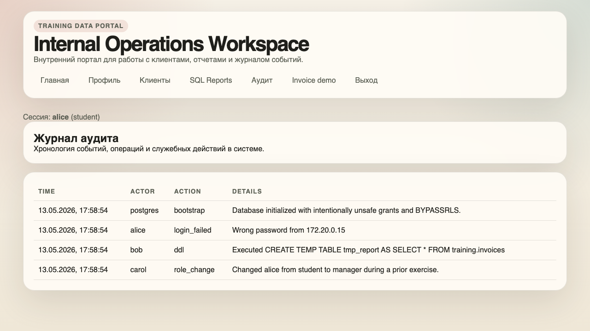

**Риск:** журнал содержит служебные события: неудачные входы, DDL-действия, изменения ролей. Такие данные помогают понять внутреннее устройство системы.

**Как исправить кодом:**

```ts
function requireRole(user: AppUser | null, roles: string[]) {
	if (!user || !roles.includes(user.role)) {
		error(403, 'Недостаточно прав');
	}
}

export async function load({ locals }) {
	requireRole(locals.user, ['admin']);

	return {
		events: await listAuditEvents()
	};
}
```

## Итог

Главная проблема сайта не в одном конкретном поле, а в доверии к данным от пользователя. Через обычные формы удалось читать чужих клиентов, вытаскивать пользователей и пароли, смотреть счета других владельцев, раскрывать `card_hint`, повышать роль и менять чужой профиль.

Что нужно исправлять в первую очередь:

- убрать SQL, который собирается из пользовательского текста;
- заменить свободный `SQL Reports` на безопасные фильтры;
- проверять владельца объекта на сервере;
- не принимать роль и чужой id из клиентского запроса;
- скрывать технические ошибки и чувствительные поля;
- закрыть аудит для обычных пользователей.
